# Host-Hitchhiker 
**Dual RNA-seq Analysis of KSHV-Human Interactions**

This repository contains the Nextflow implementation for mapping and quantifying 
pathogen transcripts within a host background. 

### Key Features:
* **Chimeric Reference Engineering**: Automated merging of Human (GRCh38) and Viral (KSHV/KT89) genomes.
* **3-Tier GTF Logic**: Custom injection of transcript/exon features to ensure 100% viral quantification accuracy in Salmon.
* **HPC Ready**: Optimized for Slurm/Xeon environments using Apptainer containers for full reproducibility.

### Pipeline Architecture

```mermaid
    flowchart TB
    %% Input Station
    subgraph INPUTS [Reference Staging]
        v1[[GRCh38 + KSHV Fasta]]
        v2[[Chimeric Biotype GTF]]
        v3[[RNA-seq FASTQs]]
    end

    %% Pre-processing Station
    subgraph PREP [Genome Preparation]
        v4([STAR_GENOMEGENERATE])
        v5([GTF2BED])
        v6([SALMON_INDEX])
    end

    %% Processing Track
    subgraph ALIGN [Dual Alignment & Quant  ]
        v7([TRIMGALORE])
        v8([STAR_ALIGN])
        v9([SALMON_QUANT])
    end

    %% Downstream Track
    subgraph POST [Biological Analysis]
        v10([DESEQ2_QC])
        v11([RSEQC_STRANDEDNESS])
        v12([MULTIQC_BIOTYPE_STATS])
    end

    %% Flow Logic
    v1 & v2 --> v4
    v2 --> v5
    v1 --> v6
    v3 --> v7
    v7 & v4 --> v8
    v8 --> v9
    v9 --> v10
    v8 --> v11
    v9 & v8 & v11 --> v12

    %% Styling for Presentation
    style v1 fill:#000000,stroke:#333,stroke-width:2px
    style v2 fill:#000000,stroke:#333,stroke-width:2px
    style v8 fill:#27ae60,color:#fff,stroke-width:3px
    style v9 fill:#27ae60,color:#fff,stroke-width:3px
    style v12 fill:#3498db,color:#fff,stroke-width:2px
```



```bash
#Viral Identifiers in the FASTA
grep ">" human_dual_virus_combined.fasta | grep -E "NC_009333.1|KT899744.1"

# Viral Identifiers in the GTF
awk '{print $1}' human_dual_virus_combined.gtf | grep -E "NC_009333.1|KT899744.1" | sort | uniq

# how many genes, transcripts, and exons
awk -F'\t' '$1 ~ /NC_009333.1|KT899744.1/ {print $1, $3}' human_dual_virus_combined.gtf | sort | uniq -c
